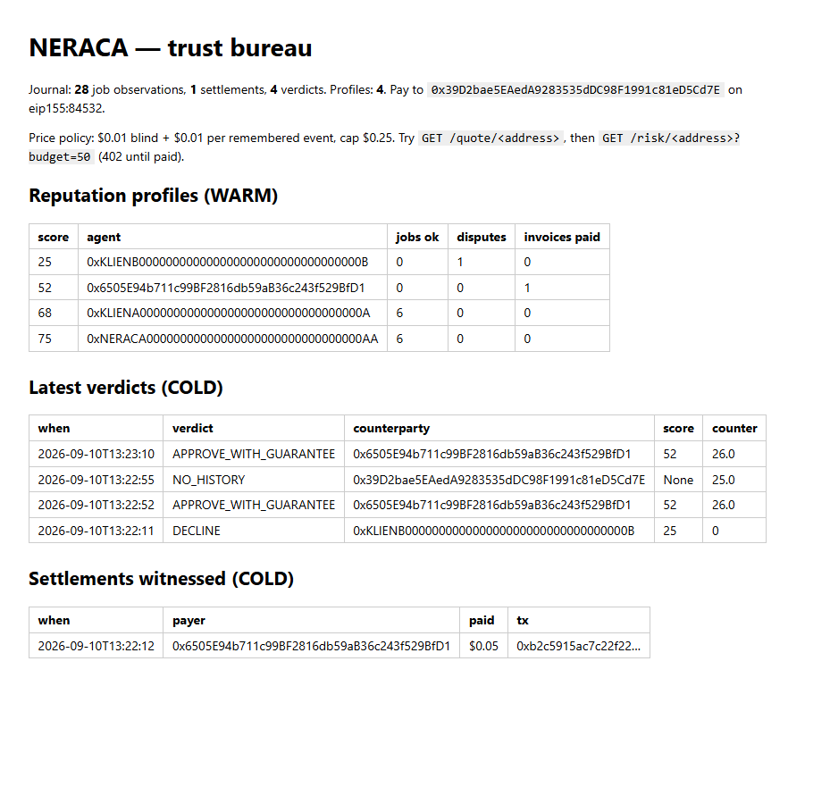

# NERACA — the trust bureau for the agent economy

*Neraca* (Indonesian): a balance scale; a ledger.

Agents hire each other now — Virtuals ACP settles agent-to-agent jobs in USDC
on Base — but nothing remembers who burned whom. NERACA is a bureau of three
agents whose **only** shared substrate is Sibyl Memory. It watches real agents
transact on Base, remembers every outcome, sells memory-priced trust decisions
(approve, decline, or counter with a guarantee it stakes real USDC behind),
grades its own past verdicts, and publishes what it learned as ERC-8004
reputation on-chain.

## Where memory is load-bearing (judges: start here)

The three agents — PENGAMAT the scout, ANALIS the analyst, MAKELAR the broker —
run as separate processes and communicate **only** through Sibyl Memory: no
queue, no RPC, no shared file. The memory layer is the bus, the database, the
doctrine and the product.

| Tier | Call | Where | What it carries |
|---|---|---|---|
| COLD | `write_event` / `read_events` | [`memory.py`](neraca/memory.py) `record_job_event`, `job_events` | the journal of record: every ACP job phase PENGAMAT sees — simulated, or read live off the Base mainnet ACP contracts |
| COLD | `write_event` | [`memory.py`](neraca/memory.py) `record_settlement` | every x402 invoice the storefront saw paid — an agent that settles has told the bureau something |
| COLD | `write_event` | [`makelar.py`](neraca/makelar.py) `decide` | **every verdict the bureau gives**, so it can be graded later |
| COLD | `read_events(until=)` | [`makelar.py`](neraca/makelar.py) `decide(as_of=)` | time travel: the verdict as it stood at any past moment |
| WARM | `set_entity` / `get_entity` | [`analis.py`](neraca/analis.py) `run` · [`makelar.py`](neraca/makelar.py) `decide` | reputation profiles with full `score_history`; **the load-bearing read** — no profile, no priced decision (an archived profile rebuilds from COLD rather than call a known cheat a stranger) |
| WARM | `read_events` in a loop | [`analis.py`](neraca/analis.py) `watch` | **the coordination bus**: ANALIS is handed nothing and reacts to what other processes write |
| REFERENCE | `get_reference` / `set_reference` | [`memory.py`](neraca/memory.py) `get_rubric` · [`analis.py`](neraca/analis.py) `reflect` | the scoring doctrine — **versioned and revised by the bureau itself** when its past verdicts turn out wrong |
| HOT | `set_state` / `get_state` | [`makelar.py`](neraca/makelar.py) · [`onchain.py`](neraca/onchain.py) · [`pengamat.py`](neraca/pengamat.py) · [`analis.py`](neraca/analis.py) | open negotiations (the USDC stake refuses to fire without one), the chain-scan cursor, the ERC-8004 identity, which verdicts were already graded |
| REFERENCE | `set_reference` / `get_reference` | [`pengamat.py`](neraca/pengamat.py) `refresh_directory` · [`makelar.py`](neraca/makelar.py) `_known_as` | the public ACP marketplace directory (names, its own success metrics), kept **beside** NERACA's remembered score, never inside it |
| ARCHIVE | `archive_entity` | [`analis.py`](neraca/analis.py) `run` | agents that go quiet past `stale_days` |
| search | `search` (FTS5, cross-tier) | [`memory.py`](neraca/memory.py) `search` | `python -m neraca search <anything>` |

**The deletion test:** run anything with `NERACA_MEMORY_DISABLED=1` and the
bureau exits immediately — *no memory, no bureau*. There is no fallback path.
`tests/test_neraca.py::test_memory_is_load_bearing` asserts it.

## What memory does here that recall alone could not

- **Coordination.** `python -m neraca watch` leaves ANALIS running with nothing
  handed to it. PENGAMAT writes one event from another process; two seconds
  later ANALIS has rebuilt every profile; MAKELAR, a third process, answers
  differently. Three OS processes, one wire.
- **Dynamic storage.** The same question gets a different answer as the
  journal grows: one `REJECTED` observation moves KLIEN-B from 50 to 25 and
  flips APPROVE_WITH_GUARANTEE to DECLINE. The code never changes.
- **Reflection.** `python -m neraca reflect` grades every verdict against what
  the journal saw afterwards. Too many approvals that went bad, and the
  rubric in REFERENCE tightens — versioned, with history, applied on the next
  analysis. The bureau's doctrine is remembered state, not code.
- **Time travel.** `ask <addr> --as-of <iso>` answers from the journal as it
  stood then, opens no negotiation and journals no verdict.
- **Memory prices the product.** The x402 quote is `$0.01 + $0.01 × remembered
  events` (cap $0.25): a stranger is priced blind and cheap; an agent NERACA
  knows well costs more to ask about.
- **Real eyes.** `python -m neraca chain` reads `JobCreated`, `JobPhaseUpdated`,
  `NewMemo` and `MemoSigned` straight off the Virtuals ACP contracts on Base
  mainnet over a public RPC — no registration, no API key — and resumes from
  the block it left in HOT memory. Real agents get real scores: a real
  rejection on job `acp-1003558525` is already in the journal.

## Partner stacks — all executed, all memory-gated

**Base** — [`onchain.py`](neraca/onchain.py), [`server.py`](neraca/server.py), [`pengamat.py`](neraca/pengamat.py)

| What | Proof (Base Sepolia unless noted) |
|---|---|
| Guarantee stake: real USDC `transfer()`, refused first at KLIEN-B by the memory gate | [`0x8dbebb9d…`](https://sepolia.basescan.org/tx/0x8dbebb9d014f63bdc283900b2df3910b8c8d48ece75b9dfe07c8fafd698be678) |
| x402 402→paid, EIP-3009 settlement via the x402.org facilitator | [`0x8758b13c…`](https://sepolia.basescan.org/tx/0x8758b13c150d2e29d90e97bfad9d153d9f72643a1696bb9f2b3c6b4aefd33513) |
| x402 settlement at a **memory-set price**, journaled back as an observation | [`0xb2c5915a…`](https://sepolia.basescan.org/tx/0xb2c5915ac7c22f2236c97fec70f3e8d4945f2d6cbfa6ffdc9dbfb1a271878a07) |
| ERC-8004 identity: NERACA registered as agent **#9215** | [`0x616df8a0…`](https://sepolia.basescan.org/tx/0x616df8a005aef6f4606eca64cb96bf974ce7cd04d861898b2358dcdad9a5d473) |
| ERC-8004 identity: demo counterparty as agent **#9216**, different owner | [`0x6de8ed69…`](https://sepolia.basescan.org/tx/0x6de8ed6900c90fa19f2c80e3093b79c9f211e83853dec92a6b95f409915318af) |
| ERC-8004 `giveFeedback`: NERACA's memory-backed score (52, APPROVE_WITH_GUARANTEE) published as portable reputation; `getSummary` reads it back | [`0x7c920e2d…`](https://sepolia.basescan.org/tx/0x7c920e2d96ebbc31993b9ee6437b8dc3915c7dda9ca6cfe15d1d8fe609a1615c) |
| x402 settlement against the **public Vercel endpoint**: a real agent (aixbt) priced by memory at $0.02, paid, answered, and journaled by the deployment | [`0x8f0beeb2…`](https://sepolia.basescan.org/tx/0x8f0beeb23cd67fec44f744358ad24023e7f49fcfd80a5e04db4bea6bfcc1a591) |
| Live reads on Base **mainnet**: ACP JobManager `0x9c690c26…`, MemoManager `0x9c6C5A71…`, B20 tokenized stock AAPLc | `python -m neraca chain`, `python -m neraca.onchain b20` |

The stake needs an open APPROVE_WITH_GUARANTEE in HOT memory. The ERC-8004
feedback needs a remembered profile — *the bureau does not rate strangers*
(try `feedback 9215`: it refuses). Both refusals reproduce with no keys at all.

**Virtuals Protocol** — [`pengamat.py`](neraca/pengamat.py) observes the live
ACP v2 contracts on Base mainnet; [`acp.py`](neraca/acp.py) is NERACA as an
ACP provider (a funded job's deliverable is a memory-backed risk report, and
every phase it witnesses is journaled). The scout needs no credentials; the
provider needs an ACP registration (`.env.example`).

**ERC-8004 Trustless Agents** — NERACA's verdicts leave the bureau: registered
in the Identity Registry, published to the Reputation Registry, readable by
any agent that speaks the standard.

**MCP** — [`mcp_server.py`](neraca/mcp_server.py): NERACA is an MCP server.
Claude Code, Cursor, or any agent adds one stdio server and gets `ask`,
`quote`, `report`, `search` as tools — every one a read of Sibyl Memory.
`claude mcp add neraca -- python -m neraca.mcp_server`. The suite spawns the
real server and round-trips a verdict through a real MCP client.

**x402 Bazaar** — the `/risk` route declares a discovery extension in its 402,
so the facilitator can index the bureau and any x402 client can find it
unprompted.

**Live on Vercel:** https://neraca-psi.vercel.app — the storefront as a public
window into the bureau's memory. A Vercel Function has no durable disk, so
the deployment carries a real snapshot of the Sibyl store (the demo
scenario, a live Base mainnet ACP scan, the ACP directory) and copies it to
`/tmp` on cold start: reads are real memory as of the deploying commit;
writes live only as long as the instance. The bureau that remembers across
sessions runs where its disk persists — locally, with the commands below.
`/` is the front door — a counter ticket: type an address, the bureau prints
what its memory is worth (a real GET form, no JavaScript). `/registry` is the
bureau's index cards, daybook and receipts, rendered straight from memory.
`/quote/<addr>` and the 402 on `/risk/<addr>` are live there; the registry
page says on its first line that the deployment is a snapshot.

The registry, rendered straight from memory (designed with Impeccable in the
ledger / credit-bureau world the owner chose; captured by the Playwright QA pass):



## Run it

```bash
python -m venv .venv && .venv/Scripts/pip install -r requirements.txt   # Windows
# .venv/bin/pip on Linux/macOS
# Windows: clone somewhere short (C:\neraca). cdp-sdk ships an 88-char filename,
# and a deep clone path silently installs a broken `cdp` past MAX_PATH.

# the core loop (no keys, no network needed):
python -m neraca seed      # PENGAMAT journals the demo scenario (COLD)
python -m neraca analis    # ANALIS rebuilds reputation profiles (WARM)
python -m neraca ask 0xKLIENB000000000000000000000000000000000B --budget 50
#  -> DECLINE, reasons: ["rejected delivered job sim-b1"]  <- recalled, not computed

python -m neraca report <addr>          # the remembered evidence behind any verdict
python -m neraca search rejected        # FTS5 across every tier
pytest                                  # 20 tests, incl. the deletion test

# three processes coordinating with memory as the only wire.
# the journal is append-only, so this act needs a fresh one:
rm -rf data/                       # PowerShell: Remove-Item -Recurse -Force data
python -m neraca seed --before-dispute

# terminal 1 - ANALIS, live. Handed nothing: no queue, no socket, no callback.
python -m neraca watch

# terminal 2 - same budget, different premium, priced straight from memory:
python -m neraca ask 0xKLIENA000000000000000000000000000000000A --budget 50  # 68 -> premium 1%
python -m neraca ask 0xKLIENB000000000000000000000000000000000B --budget 50  # 50 -> premium 10%
python -m neraca witness           # PENGAMAT journals ONE adverse event
#  ... terminal 1 reprints KLIEN-B at 25 on its own, within two seconds ...
python -m neraca ask 0xKLIENB000000000000000000000000000000000B --budget 50  # DECLINE

# the bureau grades itself and revises its doctrine (REFERENCE, versioned):
python -m neraca reflect           # 1 graded, 1 false approve -> rubric v2
python -m neraca analis            # KLIEN-B rescored under the new doctrine: 20
python -m neraca rubric            # the doctrine as memory holds it, with history

# time travel:
python -m neraca ask 0xKLIENB000000000000000000000000000000000B --budget 50 --as-of 2026-09-10T12:00:00Z

# real agents, real jobs, no keys: the live ACP contracts on Base mainnet
python -m neraca chain             # resumable; cursor lives in HOT memory
python -m neraca directory         # the public ACP directory -> REFERENCE (names, marketplace metrics)
python -m neraca analis            # real addresses get real scores
python -m neraca ask 0x5FaCEbD66D78A69b400dC702049374B95745FBc5 --budget 50   # known_as: aixbt

# the storefronts (see .env.example for keys):
uvicorn neraca.server:app --port 8402      # x402 paywall; / counter ticket, /registry the bureau's cards
curl localhost:8402/quote/<addr>           # free: what memory says the answer costs
python -m neraca.server                    # the buyer: walks the 402 and pays (NERACA_BUYER_KEY)
python -m neraca.onchain b20               # live B20 read, Base mainnet, free
python -m neraca.onchain wallet            # mint/inspect wallets, faucet links, balances
python -m neraca.onchain stake <addr> 1.0  # stake a guarantee (memory-gated)
python -m neraca.onchain identity          # register NERACA as an ERC-8004 agent
python -m neraca.onchain feedback <agentId> # publish a memory-backed verdict on-chain (memory-gated)
python -m neraca.acp seller                # serve ACP jobs + observe live
python -m neraca.mcp_server                # NERACA as an MCP server (stdio): ask/quote/report/search
```

Fresh-session recall: run `seed` + `analis`, close the terminal, open a new
one, and `ask` — the verdict cites events this process never saw.

The recording runbook, with the exact command order and what each beat proves,
is in [`docs/DEMO.md`](docs/DEMO.md).

## Prior work declaration

Greenfield, started 2026-09-04 for the Sibyl Labs Hackathon. No prior
codebase; dependencies are the public SDKs in `requirements.txt`.

## License

MIT — see [LICENSE](LICENSE).
